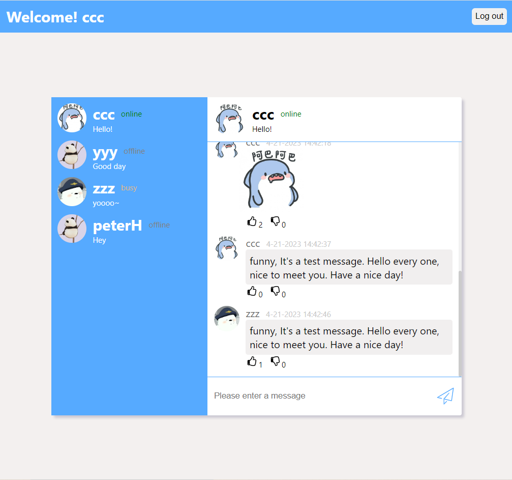
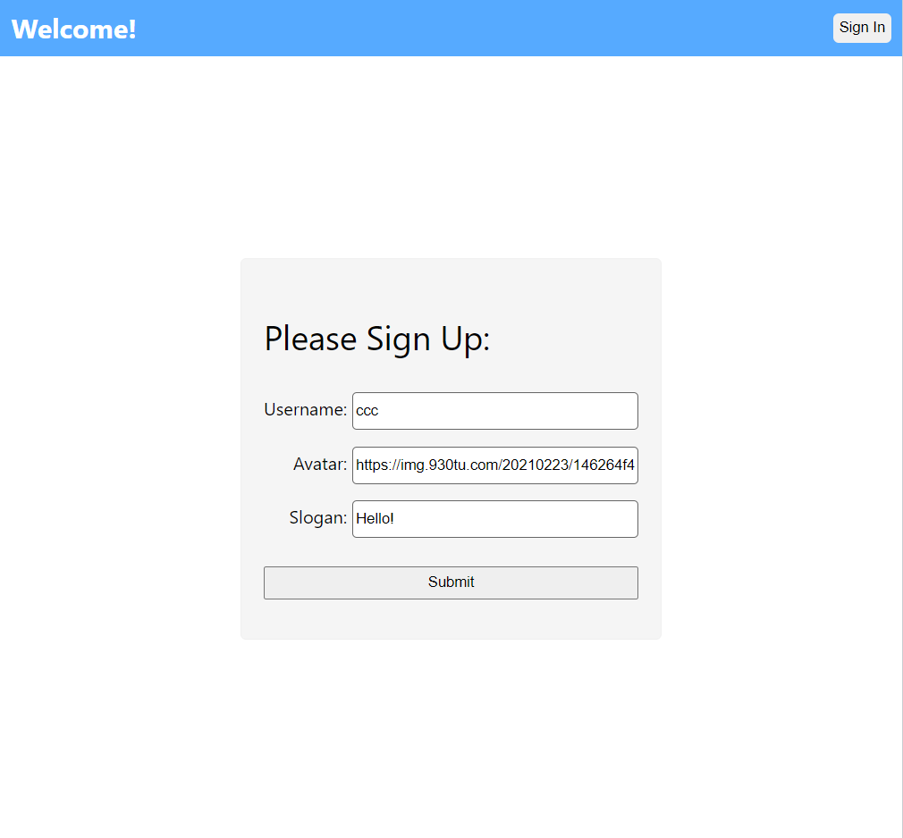
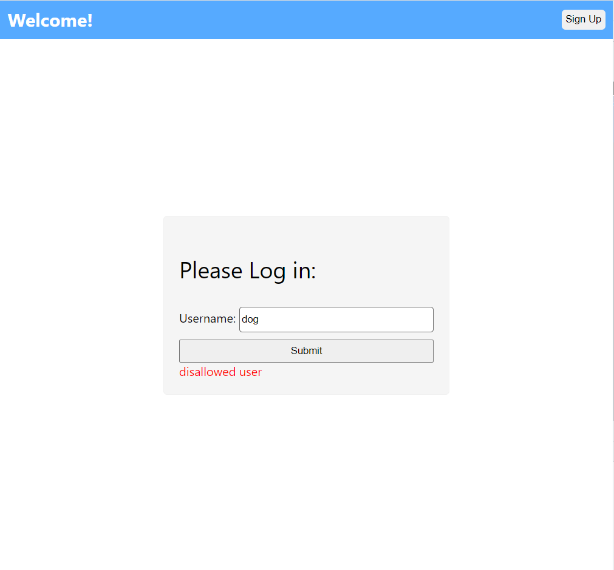
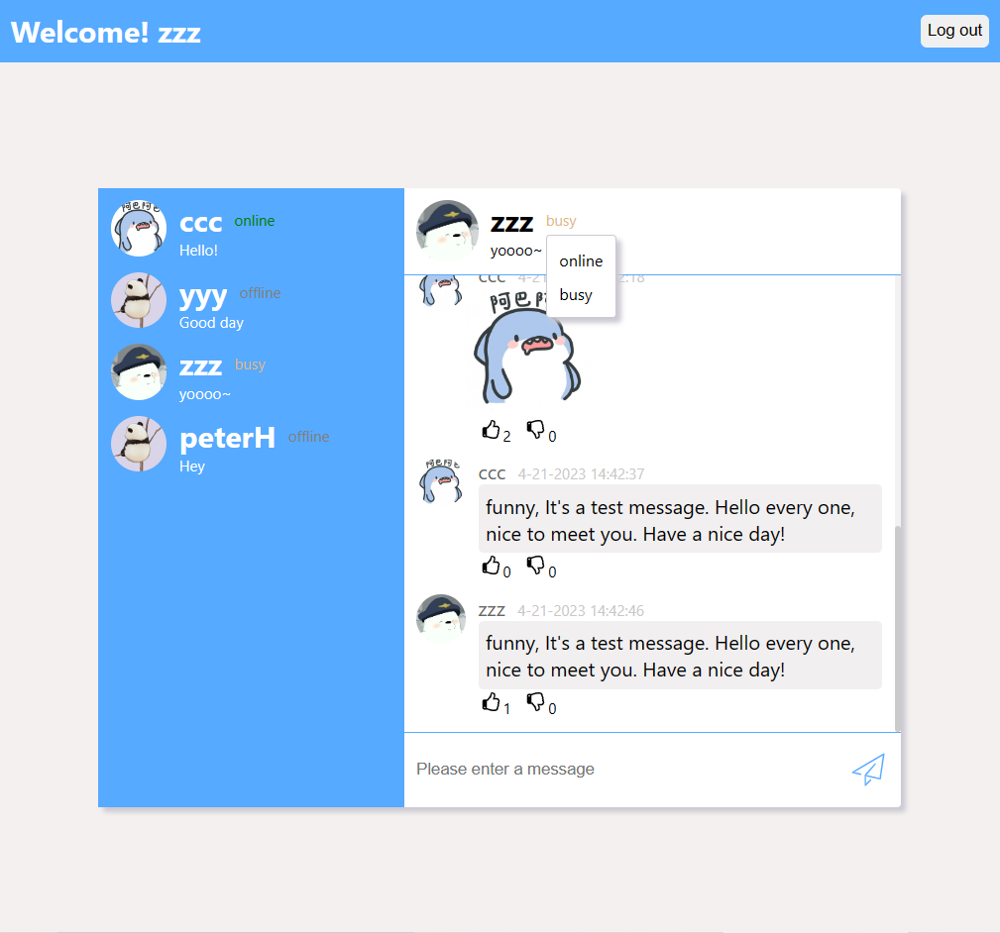

# Online Chat Room
This is a website where people can chat with each other. 
You can see who else is signed up and if they're online or not.


# User
## Sign up
User could sign up with username, avatar, slogan(no more than 20 character).
The username must be valid(no dog).
If no avatar, it would provide default avatar.


## Log in
Only exist user can log in



# Logged User can

## Get info
* User list that show all "exist user"
* You could check the user status as "online", "offline", "busy"

## Chat
* Chatroom will display all the information
* Msg will show the user, avatar, sending time
* User could send text message or picture. I
* If image link is detected, it would be displayed as picture automatically.
* User have 3 status, user could set their status "online", "offline", "busy"
* User could thumb-up/down on message
  

# How to run

Dev mode, run with two terminal
```
npm run start
npm run dev
```

Display mode, run all the commands one by one
```aidl
npm install
npm run build
npm start
```